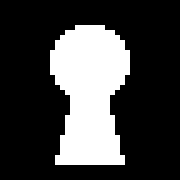
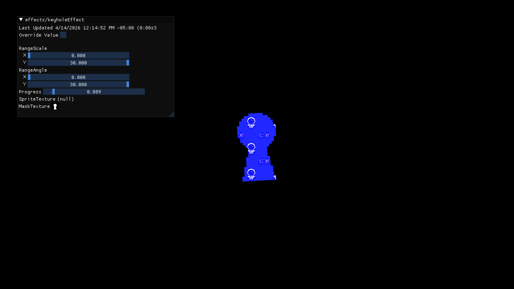

# Keyhole Scene Transition Effect for MonoGame
Hi! I've been working my way through the new [Advanced 2D Shaders in MonoGame](https://docs.monogame.net/articles/tutorials/advanced/2d_shaders/index.html) and I wanted to tinker a bit with what was shown in Chapter 05.

What I had in mind was to recreate the scene transition used in games like Banjo-Kazooie. It looks like a sort of keyhole, where only part of the current screen is visible using a mask. More (or less) of the screen is visible as this mask is scaled and rotated, so it gives this sort of effect where you are looking through a keyhole (hence the name). I decided to share what I made so feel free to use it on your own projects or modify it.

This is the result:

https://github.com/user-attachments/assets/8fd708e9-dcc9-4bf1-ab44-a2fc6f95653f

In this case, this is the mask used:



## Effect Explanation
Note that the rest of the tutorial assumes that you are also following the Advanced 2D Shaders tutorial for MonoGame. However, you should be able to apply the shader in your own project even if it differs.

You can find the shader code I used [here](https://github.com/jdmedinatobon/keyhole-shader-effect-hlsl/blob/main/keyholeEffect.fx) or just go to the repository and look for the keyholeEffect.fx.

The effect has three components to it:
1. Mask Texture: this is a black and white texture set by parameter. Whatever is in white will be made transparent in the screen.
2. Scale: the scale of the mask texture. As it gets scaled up, or down, more or less of the screen will be made visible.
3. Rotation: the rotation of the mask texture. For some added flavor, the mask texture can also be rotated.

All of these are set through parameters in the effect code, as is shown below for the first section of the code:
```
// Parameter used to set the minimum and maximum values for the Scale of the Mask Texture.
float2 RangeScale;

// Parameter used to set the minimum and maximum values for the Rotation of the Mask Texture.
// NOTE: This shader assumes that the range is in degrees and not radians, which I think is
// more intuitive when setting the parameters.
float2 RangeAngle; // in degrees

// Parameter used to advance the scene transition effect using the rangeScale and rangeAngle values.
float Progress;

Texture2D SpriteTexture : register(t0);
Texture2D MaskTexture : register(t1);
```
There is an additional parameter, Progress, which is used to linearly interpolate the scale and rotation between the values set in the Range for each one. This is what is used to advance the scene transition, whether it is opening or closing. For example, when a scene opens, it seems more natural to begin with a small mask that gets bigger and bigger and shows more of the screen until all of it is visible. On the contrary, when a scene closes, the mask would get smaller and smaller until very little of the screen is visible. The Progress parameter controls this transition.

These parameters are set in your C# code for your project. This will be shown later on. Next, the sampler_state definitions are:

```
sampler2D SpriteTextureSampler : register(s0) = sampler_state
{
    Filter = Point;
    Texture = <SpriteTexture>;
};

sampler2D MaskTextureSampler : register(s1) = sampler_state
{
    Filter = Point;
    Texture = <MaskTexture>;
    AddressU = Clamp;
    AddressV = Clamp;
};  
```

There are two definitions, one for the main texture, which is the image that is rendered during Draw(), and another one for the mask texture, which is set by parameter. The state assignments (Filter, AddressU, AddressV) are set to:
1. Filter = Point. Since the mask texture is pixel art, setting Filter to Point correctly upscales the mask texture without smoothing. Modify this value to something else if you're using a different mask texture.
2. AddressU and AddressV = Clamp. This clamps values below 0 to 0 and above 1 to 1. In this case, this is used so that anything outside of the mask texture is drawn black. You can change this to other values, too. For example, setting it to Wrap will tile the mask texture across the screen.

Note that the main texture will not be used, but I've left it here to avoid issues where the MaskTextureSampler can get overridden by it. After that, I've added a function that rotates a 2d vector by a given angle:
```
// Rotates a vector by a given angle.
float2 rotate2D(float2 v, float angle)
{
    float c = cos(angle);
    float s = sin(angle);

    float2x2 rMatrix = {
        c, -s,
        s, c
    };

    return mul(rMatrix, v);
}
```

Finally, the meat of the effect is as follows inside MainPS:
```
// Linearly interpolate between the minimum and maximum values for the scaling and rotation of the effect
// using the Progress parameter.
float scale = lerp(RangeScale.x, RangeScale.y,  1 - Progress);
float angle_degrees = lerp(RangeAngle.x, RangeAngle.y,  1 - Progress);
float angle = radians(angle_degrees);    
```
This first part uses linear interpolation (lerp) to obtain a scale and angle value according to the Progress parameter. I thought it was more natural to modify an angle in degrees, so the angle is converted to radians at this step.

```
// Vector used to correct the mask texture (which is in a 1:1 ratio) to the 16:9 ratio of the screen.
float2 aspect_ratio = float2(16.0f/9.0f, 1);

// The mask texture is scaled around the center of the image.
// Change this value if you want the image to scale using another reference point.
float2 center = float2(.5f, .5f);   

// Coordinates from the main texture.
float2 uv = input.TextureCoordinates;
```

Next, a correction has to be done to the mask texture according to the aspect ratio of the screen, in this case being 16:9 while the mask texture is square 1:1. Modify this variable if you have a different aspect ratio. Without this correction, the mask texture will get scaled along the x axis and will look stretched horizontally. Note that the actual scaling is done later on in the code. In addition, there is also a center variable, which is the reference point for rotation and scaling. In this case, I wanted the mask texture to be scaled and rotated around its center, so it is set to (0.5, 0.5). Feel free to modify this value if you want the scaling and rotation to use another reference point. Finally, the coordinates from the main texture are obtained.

```
// First, scale the mask texture using the aspect ratio to correct the image.
// Without this step, the image will get stretched in the x direction.
float2 uv_corrected = (uv - center) * aspect_ratio + center;

// Then, scale the mask texture by the current scale amount.
float2 uv_scaled = (uv_corrected - center) * scale + center;

// Finally, rotate the mask texture by the current angle amount.
float2 uv_rotated = rotate2D(uv_scaled - center, angle) + center; 

// Sample the scaled mask texture.
float4 color = tex2D(MaskTextureSampler, uv_rotated);
```
Next, the scaling and rotation and sampling of the mask texture is done. First, the mask texture gets corrected using the aspect ratio so that it goes back to its original square format. Then, the scaling and rotation are applied using the center reference point. Finally, the scaled and rotated mask texture is sampled.

```
// The mask texture uses white pixels to know which pixels should be made transparent.
if (color.r == 1)
{
    color = float4(0, 0, 0, 0);
}

return color;
```
In the end, you obtain either a black or a white color that is used at this step to know where to make the screen transparent. White colors return a transparent color. Note that the only check being done is if the red channel is 1 (colors are between 0 and 1 here), since this code assumes the mask texture is either black or white.

Another thing to note, the color returned for transparency has each color channel set to 0 and the transparency set to 0. I'm not entirely sure what is happening, but it seems like the default alpha-blending does not simply make a pixel transparent when the alpha channel is set to 0. For example, if you set the blue channel to 1 like this

```
if (color.r == 1)
{
    color = float4(0, 0, 1, 0);
}
```
your screen will get a blue tint where it should be transparent, even though the alpha channel is 0. Thus, it is necessary that each color channel is set to 0, too.
<center></center>

## Integrating in your project

If you've been following the Advanced 2D Shaders Tutorial for MonoGame, integrating this shader should be similar to the scene transitions shown there. If not, you should still be able to integrate it by setting the Progress parameter during runtime and setting the MaskTexture, RangeScale and RangeAngle parameters when loading content.

First, add a variable in your Core class to keep a static reference to the keyhole effect material:

```
public static Material KeyholeTransitionMaterial { get; private set; }
```

Then, load the keyhole effect as a Material in LoadContent() and set the three parameters:

```
KeyholeTransitionMaterial = Content.WatchMaterial("effects/keyholeEffect");
KeyholeTransitionMaterial.IsDebugVisible = true;
Texture2D mask = Content.Load<Texture2D>("effects/textures/keyhole_mask");
KeyholeTransitionMaterial.SetParameter("MaskTexture", mask);
KeyholeTransitionMaterial.SetParameter("RangeScale", new Vector2(0, 30));
KeyholeTransitionMaterial.SetParameter("RangeAngle", new Vector2(0, 30));
```

Next, set the Progress parameter and Update the material inside Update():

```
KeyholeTransitionMaterial.SetParameter("Progress", SceneTransition.DirectionalRatio);
KeyholeTransitionMaterial.Update();
```

Finally, after your scene is drawn, add the draw call for the effect:

```
// activeScene draw call over here...

SpriteBatch.Begin(effect: KeyholeTransitionMaterial.Effect);

SpriteBatch.Draw(
    Pixel,
    GraphicsDevice.Viewport.Bounds,
    Color.White);
    
SpriteBatch.End();

// debug UI and other draw calls here...
```

Pixel here is a 1x1 black pixel used to draw the entire screen black. Add the following to the Initialize() method:
```
// Create a 1x1 white pixel texture for drawing quads
Pixel = new Texture2D(GraphicsDevice, 1, 1);
Pixel.SetData(new Color[] { Color.Black });
```

That should be it! You can play around with the range of the Scale and Angle parameters until you find something that you like. You can also try other mask textures and see what results you get. Good luck with your projects!

If you've read until here, consider checking out my [youtube channel](https://www.youtube.com/@Hero_GameDev) if you're interested in what I've been working on!

